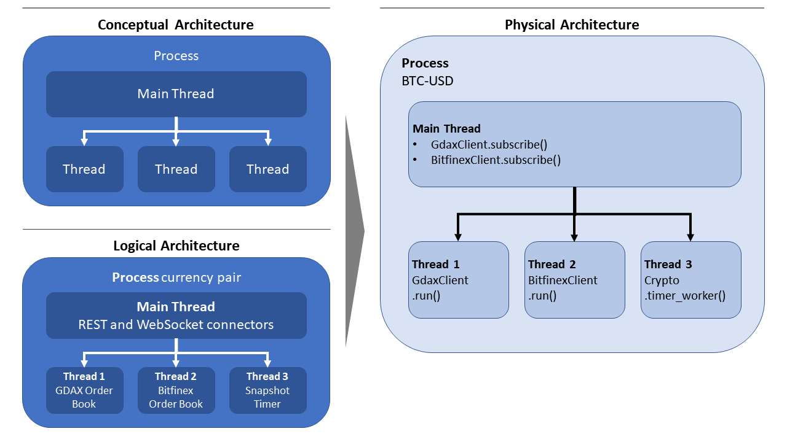

# Multiprocessing Crypto Recorder (streaming ticks - full)
As of October 10th, 2018.

## 1. Purpose
The purpose of this application is to record full limit order book and trade tick data 
from **Coinbase Pro** and **Bitfinex** into an Arctic Tickstore database (i.e., MongoDB) 
to perform reinforcement learning research.

There are multiple branches of this project, each with a different implementation pattern for persisting data:
 - **FULL** branch is intended to be the foundation for a fully automated trading system (i.e., implementation of
 design patterns that are ideal for a trading system that requires parallel processing) and  persists streaming 
 tick data into an **Arctic Tick Store**
 - **LIGHT WEIGHT** branch is intended to record streaming data more efficiently than the __full__ branch (i.e., 
 all websocket connections are made from a single process __and__ the limit order book is not maintained) and
 persists streaming tick data into an **Arctic tick store**
 - **ORDER BOOK SNAPSHOT** branch has the same design pattern as the __full__ branch, but instead of recording 
 streaming ticks, snapshots of the limit order book are taken every **N** seconds and persisted 
 into an **Arctic tick store**
 - **MONGO INTEGRATION** branch is the same implementation as **ORDER BOOK SNAPSHOT**, with the difference being 
 a standard MongoDB is used, rather than Arctic. This branch was originally used to benchmark Arctic's 
 performance and might not be up to date with the **FULL** branch.

## 2. Scope
Application is intended to be used to record limit order book data for reinforcement learning modeling. 
Currently, there is no functionality developed to place order and actually trade.

## 3. Dependencies
- abc
- [arctic](https://github.com/manahl/arctic)
- asyncio
- datetime
- json
- multiprocessing
- os
- pandas
- pytz
- requests
- SortedDict
- threading
- time
- websockets

## 4. Design Pattern
The design pattern is intended to serve as a foundation for implementing a trading strategy.
### 4.1 Architecture
- Each crypto pair (e.g., Bitcoin-USD) runs on its own `Process`
  - Each exchange data feed is processed in its own `Thread` within the parent crypto pair `Process`
  - A timer for periodic polling (or order book snapshots--see `mongo-integration` or `arctic-book-snapshot` 
  branch) runs on a separate thread

### 4.2 Arctic Schema
**Arctic tick store** is the database implementation of choice for this project for the 
following reasons:
 - Open sourced reliability
 - Superior performance metrics (e.g., 10x data compression)

The **arctic tick store** data model is essentially a `list` of `dict`s, where 
each `dict` is an incoming **tick** from the exchanges.
- Each `list` consists of `./common_components/configs.BATCH_SIZE` ticks (e.g., 100,000 ticks)
- Per the Arctic Tick Store design, all currency pairs are stored in the **same** MongoDB collection

### 4.3 Limit Order Book
**SortedDict** python class is used for the limit order book
for the following reasons:
- Sorted Price **Insertions** within the limit order book
 can be performed with **O(log n)**
- Price **Deletions** within the limit order book can be performed with **O(1)**
- **Getting / setting** values are performed with **O(1)**
- **SortedDict** interface is intuitive, thus making implementation easier

## 5. Appendix
### 5.1 Assumptions
- You know how to start up a MongoDB database and have mongoDB installed already
- You know how to use Git tools
- You are familiar with python3

### 5.2 To-dos:
1. Create a back testing simulation environment using GYM
2. Integrate Tensorflow into trading model
3. Integrate FIX API to enable live trading
